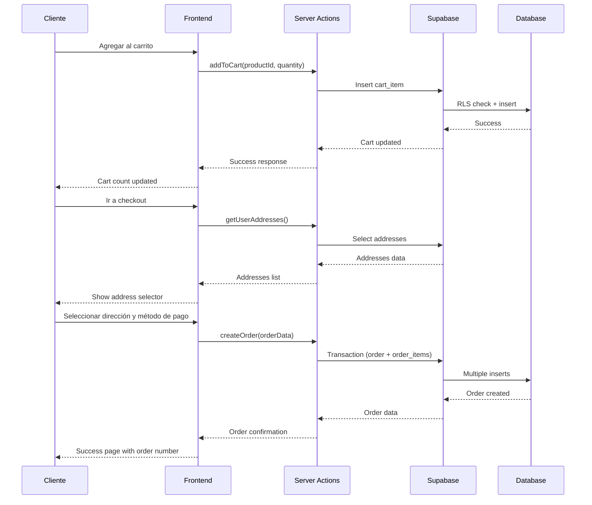
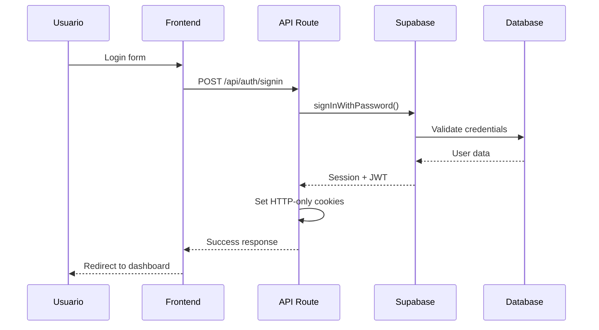

# API Reference

Documentación completa de las APIs y Server Actions de ACEROMAX E-Commerce.

## 🔗 API Routes

### Autenticación

#### `POST /api/auth/signin`

Iniciar sesión con email y contraseña.

**Request:**
```json
{
  "email": "user@example.com",
  "password": "password123"
}
```

**Response:**
```json
{
  "success": true,
  "user": {
    "id": "uuid",
    "email": "user@example.com"
  },
  "session": {
    "access_token": "jwt-token",
    "refresh_token": "refresh-token"
  }
}
```

#### `POST /api/auth/signup`

Registrar nuevo usuario.

**Request:**
```json
{
  "email": "user@example.com",
  "password": "password123"
}
```

**Response:**
```json
{
  "success": true,
  "message": "Account created successfully"
}
```

#### `POST /api/auth/signin-otp`

Enviar magic link por email.

**Request:**
```json
{
  "email": "user@example.com"
}
```

**Response:**
```json
{
  "success": true,
  "message": "Magic link sent to your email"
}
```

#### `POST /api/auth/oauth`

Iniciar sesión con OAuth (Google).

**Request:**
```json
{
  "provider": "google"
}
```

**Response:**
```json
{
  "success": true,
  "url": "https://accounts.google.com/oauth/authorize?..."
}
```

#### `GET /api/auth/user`

Obtener información del usuario actual.

**Response:**
```json
{
  "success": true,
  "user": {
    "id": "uuid",
    "email": "user@example.com",
    "role": "customer"
  }
}
```

#### `POST /api/auth/signout`

Cerrar sesión.

**Response:**
```json
{
  "success": true,
  "message": "Signed out successfully"
}
```

## ⚡ Server Actions

### Gestión de Productos

#### `getAllProducts(page, limit)`

Obtener todos los productos con paginación.

```typescript
const { products, total, totalPages } = await getAllProducts(1, 20)
```

#### `getProductsByCategory(categorySlug, page, limit)`

Obtener productos por categoría.

```typescript
const { products, total, totalPages } = await getProductsByCategory('acero-inoxidable', 1, 20)
```

#### `getProductBySlug(slug)`

Obtener detalles de un producto específico.

```typescript
const product = await getProductBySlug('acero-inoxidable-304')
```

#### `searchProducts(query, page, limit)`

Buscar productos por nombre.

```typescript
const { products, total, totalPages } = await searchProducts('acero', 1, 20)
```

### Gestión de Carrito

#### `addToCart(productId, quantity)`

Agregar producto al carrito.

```typescript
const result = await addToCart('product-123', 2)
// { success: true, message: "Producto agregado al carrito" }
```

#### `updateCartItemQuantity(itemId, quantity)`

Actualizar cantidad de un item en el carrito.

```typescript
const result = await updateCartItemQuantity('item-123', 5)
// { success: true, message: "Cantidad actualizada" }
```

#### `removeFromCart(itemId)`

Eliminar item del carrito.

```typescript
const result = await removeFromCart('item-123')
// { success: true, message: "Producto eliminado del carrito" }
```

#### `clearCart()`

Vaciar carrito completo.

```typescript
const result = await clearCart()
// { success: true, message: "Carrito vaciado" }
```

### Gestión de Direcciones

#### `getUserAddresses()`

Obtener direcciones del usuario.

```typescript
const addresses = await getUserAddresses()
// [{ id: 'addr-123', full_name: 'Juan Pérez', ... }]
```

#### `addAddress(addressData)`

Agregar nueva dirección.

```typescript
const result = await addAddress({
  type: 'shipping',
  full_name: 'Juan Pérez',
  phone: '+52 555 123 4567',
  address_line_1: 'Calle Principal 123',
  city: 'Ciudad de México',
  state: 'CDMX',
  postal_code: '01234',
  country: 'México'
})
```

#### `updateAddress(addressId, addressData)`

Actualizar dirección existente.

```typescript
const result = await updateAddress('addr-123', {
  full_name: 'Juan Carlos Pérez'
})
```

#### `deleteAddress(addressId)`

Eliminar dirección.

```typescript
const result = await deleteAddress('addr-123')
```

### Gestión de Métodos de Pago

#### `getUserPaymentMethods()`

Obtener métodos de pago del usuario.

```typescript
const paymentMethods = await getUserPaymentMethods()
// [{ id: 'pm-123', type: 'credit_card', card_brand: 'visa', ... }]
```

#### `addPaymentMethod(paymentData)`

Agregar nuevo método de pago.

```typescript
const result = await addPaymentMethod({
  type: 'credit_card',
  card_last_four: '1234',
  card_brand: 'visa',
  card_exp_month: 12,
  card_exp_year: 2025,
  provider: 'stripe',
  provider_payment_method_id: 'pm_1234567890'
})
```

#### `deletePaymentMethod(paymentMethodId)`

Eliminar método de pago.

```typescript
const result = await deletePaymentMethod('pm-123')
```

### Gestión de Órdenes

#### `createOrder(orderData)`

Crear nueva orden.

```typescript
const result = await createOrder({
  shipping_address_id: 'addr-123',
  billing_address_id: 'addr-123',
  payment_method: 'credit_card',
  shipping_method: 'standard'
})
// { success: true, orderNumber: 'ORD-ABC123-XYZ9' }
```

#### `getUserOrders(page, limit)`

Obtener órdenes del usuario.

```typescript
const { orders, total, totalPages } = await getUserOrders(1, 10)
```

#### `getOrderByNumber(orderNumber)`

Obtener detalles de una orden específica.

```typescript
const order = await getOrderByNumber('ORD-ABC123-XYZ9')
```

### Panel de Administración

#### `isAdmin()`

Verificar si el usuario actual es admin.

```typescript
const isAdminUser = await isAdmin()
// boolean
```

#### `getAllProductsAdmin(page, limit, statusFilter)`

Obtener todos los productos para admin.

```typescript
const { products, total, totalPages } = await getAllProductsAdmin(1, 20, 'active')
```

#### `createProduct(productData)`

Crear nuevo producto.

```typescript
const result = await createProduct({
  name: 'Acero Inoxidable 304',
  slug: 'acero-inoxidable-304',
  description: 'Acero inoxidable de alta calidad',
  price: 150.00,
  quantity: 100,
  category_id: 'cat-123',
  seller_id: 'seller-123'
})
```

#### `updateProduct(productId, productData)`

Actualizar producto existente.

```typescript
const result = await updateProduct('product-123', {
  price: 160.00,
  quantity: 95
})
```

#### `getAllOrdersAdmin(page, limit, statusFilter)`

Obtener todas las órdenes para admin.

```typescript
const { orders, total, totalPages } = await getAllOrdersAdmin(1, 20, 'pending')
```

#### `updateOrderStatus(orderId, status)`

Actualizar estado de orden.

```typescript
const result = await updateOrderStatus('order-123', 'shipped')
```

## 🔧 Utilidades

### Validación de Tarjetas

```typescript
import { validateCardNumber, getCardBrand } from '@/lib/payment-utils'

// Validar número de tarjeta
const isValid = validateCardNumber('4532015112830366') // true

// Detectar marca de tarjeta
const brand = getCardBrand('4532015112830366') // 'visa'
```

### Formateo

```typescript
// Formatear moneda
const formatted = new Intl.NumberFormat('es-MX', {
  style: 'currency',
  currency: 'MXN',
}).format(1500.50) // '$1,500.50'

// Formatear fecha
const formatted = new Intl.DateTimeFormat('es-MX', {
  year: 'numeric',
  month: 'long',
  day: 'numeric',
}).format(new Date()) // '13 de octubre de 2025'
```

## 🛡️ Seguridad

### Autenticación

Todas las Server Actions verifican automáticamente la autenticación:

```typescript
export async function addToCart(productId: string, quantity: number) {
  const supabase = await createClient()
  const { data: { user } } = await supabase.auth.getUser()
  
  if (!user) {
    return { success: false, error: 'Usuario no autenticado' }
  }
  
  // ... resto de la lógica
}
```

### Autorización

Las acciones de admin verifican roles:

```typescript
export async function createProduct(productData: ProductInsert) {
  if (!(await isAdminOrManager())) {
    return { success: false, error: 'No autorizado' }
  }
  
  // ... resto de la lógica
}
```

### Row Level Security

Todas las consultas a Supabase respetan las políticas RLS:

```sql
-- Ejemplo: Solo usuarios pueden ver su propio carrito
CREATE POLICY "Users can view own cart" ON carts
  FOR SELECT USING (auth.uid() = user_id);
```

## 📊 Tipos de Datos

### Product

```typescript
interface Product {
  id: string
  name: string
  slug: string
  description: string
  short_description?: string
  price: number
  compare_at_price?: number
  quantity: number
  image_url?: string
  is_active: boolean
  is_featured: boolean
  category_id?: string
  seller_id: string
  created_at: string
  updated_at: string
}
```

### Order

```typescript
interface Order {
  id: string
  order_number: string
  user_id: string
  status: 'pending' | 'processing' | 'shipped' | 'delivered' | 'cancelled' | 'refunded'
  payment_status: 'pending' | 'paid' | 'failed' | 'refunded'
  subtotal: number
  tax: number
  shipping_cost: number
  total: number
  shipping_address_id: string
  billing_address_id: string
  created_at: string
  updated_at: string
}
```

### Cart Item

```typescript
interface CartItem {
  id: string
  cart_id: string
  product_id: string
  quantity: number
  price: number
  product: {
    name: string
    image_url?: string
    sku: string
  }
}
```

## 🚨 Códigos de Error

### Errores de Autenticación

| Código | Mensaje | Descripción |
|--------|---------|-------------|
| `AUTH_REQUIRED` | "Usuario no autenticado" | Usuario no ha iniciado sesión |
| `INVALID_CREDENTIALS` | "Credenciales inválidas" | Email o contraseña incorrectos |
| `EMAIL_NOT_CONFIRMED` | "Email no confirmado" | Usuario no ha confirmado su email |

### Errores de Autorización

| Código | Mensaje | Descripción |
|--------|---------|-------------|
| `INSUFFICIENT_PERMISSIONS` | "No autorizado" | Usuario no tiene permisos suficientes |
| `ADMIN_REQUIRED` | "Se requieren permisos de administrador" | Acción solo para admins |

### Errores de Validación

| Código | Mensaje | Descripción |
|--------|---------|-------------|
| `INVALID_INPUT` | "Datos de entrada inválidos" | Formato de datos incorrecto |
| `REQUIRED_FIELD` | "Campo requerido" | Campo obligatorio faltante |
| `INVALID_EMAIL` | "Email inválido" | Formato de email incorrecto |

### Errores de Base de Datos

| Código | Mensaje | Descripción |
|--------|---------|-------------|
| `DATABASE_ERROR` | "Error de base de datos" | Error interno de Supabase |
| `RECORD_NOT_FOUND` | "Registro no encontrado" | El recurso solicitado no existe |
| `DUPLICATE_RECORD` | "Registro duplicado" | Ya existe un registro con esos datos |

## 🔄 Flujos de API

### Flujo de Compra Completo



### Flujo de Autenticación



## 📈 Rate Limiting

### Límites por Endpoint

| Endpoint | Límite | Ventana |
|----------|--------|---------|
| `/api/auth/signin` | 5 requests | 1 minuto |
| `/api/auth/signup` | 3 requests | 1 minuto |
| `/api/auth/signin-otp` | 3 requests | 1 minuto |
| Server Actions | 100 requests | 1 minuto |

### Headers de Rate Limiting

```http
X-RateLimit-Limit: 100
X-RateLimit-Remaining: 95
X-RateLimit-Reset: 1640995200
```

## 🔮 Futuras APIs

### APIs Planificadas

- [ ] **Reviews API**: Gestión de reseñas de productos
- [ ] **Notifications API**: Sistema de notificaciones
- [ ] **Analytics API**: Métricas y estadísticas
- [ ] **Inventory API**: Gestión de inventario
- [ ] **Shipping API**: Cálculo de envíos
- [ ] **Coupons API**: Sistema de cupones y descuentos

### Webhooks

- [ ] **Order Status Webhooks**: Notificaciones de cambio de estado
- [ ] **Payment Webhooks**: Confirmaciones de pago
- [ ] **Inventory Webhooks**: Alertas de stock bajo
