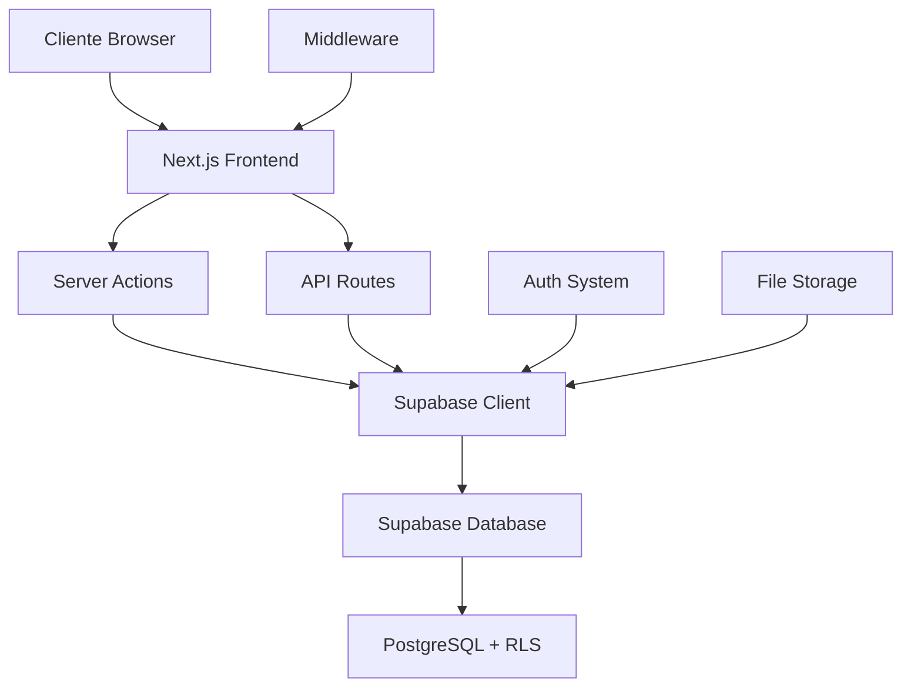
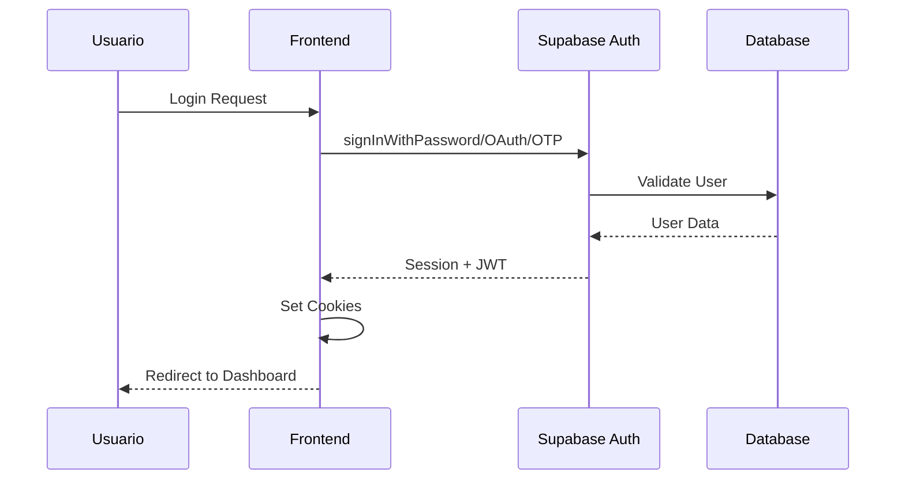
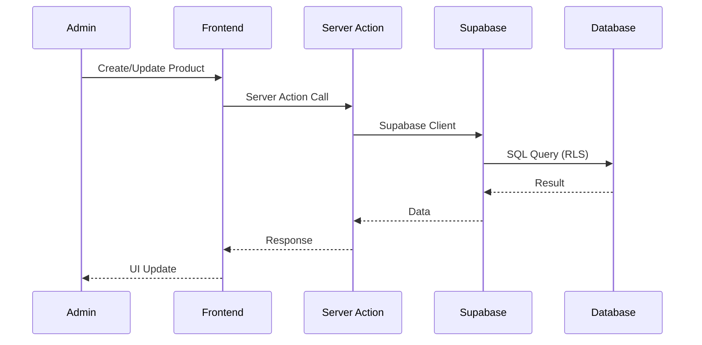
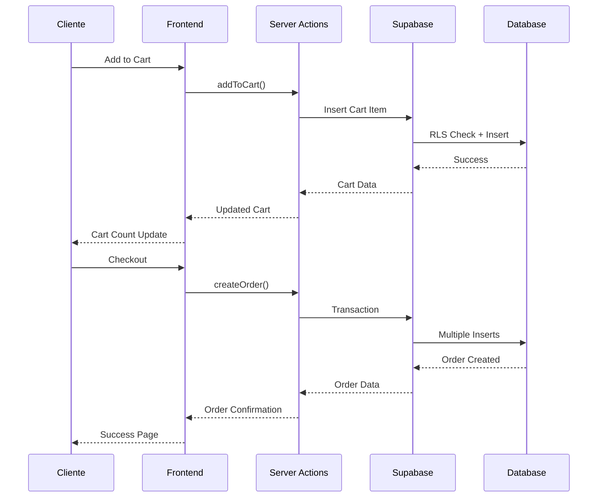
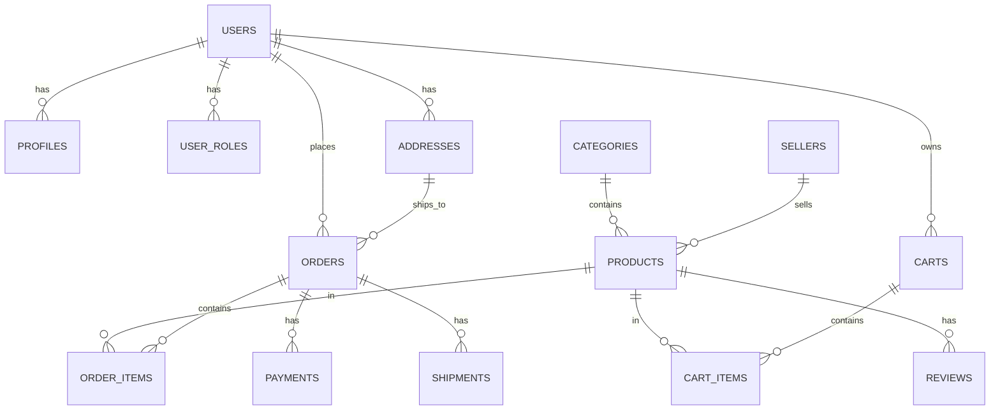

# Arquitectura del Sistema

ACEROMAX E-Commerce está construido con una arquitectura moderna full-stack que separa claramente el frontend y backend, comunicándose a través de APIs RESTful y Server Actions.

## 🏗️ Arquitectura General

### Separación Frontend/Backend

El proyecto utiliza **Next.js 15** con App Router para crear una separación clara entre:

- **Frontend**: Componentes React, páginas y UI
- **Backend**: Server Actions, API Routes y lógica de negocio
- **Base de Datos**: Supabase (PostgreSQL) con RLS



## 📁 Estructura del Proyecto

### Frontend (`src/app/`)

```
src/app/
├── (auth)/                 # Grupo de rutas de autenticación
│   ├── auth/
│   │   ├── signin/         # Página de login
│   │   ├── signup/         # Página de registro
│   │   └── callback/       # Callback OAuth/Magic Link
│   └── layout.tsx          # Layout específico para auth
├── admin/                  # Panel de administración
│   ├── layout.tsx          # Layout protegido para admin
│   ├── page.tsx            # Dashboard principal
│   ├── productos/          # Gestión de productos
│   └── pedidos/            # Gestión de pedidos
├── api/                    # API Routes (Backend)
│   └── auth/               # Endpoints de autenticación
├── carrito/                # Carrito de compras
├── checkout/               # Proceso de checkout
├── pedidos/                # Mis pedidos (cliente)
├── productos/              # Catálogo de productos
├── categorias/             # Productos por categoría
├── buscar/                 # Resultados de búsqueda
├── actions.ts              # Server Actions generales
├── cart-actions.ts         # Server Actions del carrito
├── order-actions.ts        # Server Actions de órdenes
└── address-actions.ts      # Server Actions de direcciones
```

### Componentes (`src/components/`)

```
src/components/
├── admin/                  # Componentes del panel admin
│   ├── admin-header.tsx
│   ├── admin-sidebar.tsx
│   ├── products-table.tsx
│   ├── product-form.tsx
│   ├── orders-table.tsx
│   └── order-edit-modal.tsx
├── auth/                   # Componentes de autenticación
│   └── auth-form.tsx       # Formulario unificado
├── cart/                   # Componentes del carrito
│   ├── add-to-cart-button.tsx
│   └── cart-items-list.tsx
├── checkout/               # Componentes de checkout
│   ├── checkout-flow.tsx
│   ├── address-form.tsx
│   ├── address-selector.tsx
│   ├── payment-form.tsx
│   └── payment-selector.tsx
├── orders/                 # Componentes de órdenes
│   ├── order-card.tsx
│   ├── order-details-modal.tsx
│   └── orders-list-client.tsx
├── products/               # Componentes de productos
│   ├── product-card.tsx
│   ├── product-grid.tsx
│   └── pagination.tsx
├── layout/                 # Componentes de layout
│   ├── navbar.tsx
│   ├── navbar-actions.tsx
│   └── search-bar.tsx
└── ui/                     # Componentes UI base (Shadcn/ui)
    ├── button.tsx
    ├── card.tsx
    ├── input.tsx
    ├── dialog.tsx
    └── ...
```

## 🔄 Flujo de Datos

### 1. Autenticación



### 2. Gestión de Productos



### 3. Proceso de Compra



## 🛡️ Seguridad

### Row Level Security (RLS)

Todas las tablas tienen RLS habilitado con políticas específicas:

```sql
-- Ejemplo: Política para productos
CREATE POLICY "Products are viewable by everyone" ON products
  FOR SELECT USING (is_active = true);

CREATE POLICY "Only admins can insert products" ON products
  FOR INSERT WITH CHECK (
    EXISTS (
      SELECT 1 FROM user_roles 
      WHERE user_id = auth.uid() 
      AND role IN ('admin', 'manager')
    )
  );
```

### Autenticación Multi-Método

1. **Email + Password**: Autenticación tradicional
2. **Magic Link**: OTP por email sin contraseña
3. **OAuth Google**: Autenticación social con PKCE

### Middleware de Seguridad

```typescript
// middleware.ts
export async function middleware(request: NextRequest) {
  // Skip middleware for auth callback to avoid interfering with PKCE flow
  if (request.nextUrl.pathname === '/auth/callback') {
    return
  }

  // Update Supabase session
  return await updateSession(request)
}
```

## 🗄️ Base de Datos

### Esquema Principal



### Tablas Principales

| Tabla | Propósito | RLS |
|-------|-----------|-----|
| `users` | Usuarios de Supabase Auth | ✅ |
| `profiles` | Perfiles extendidos | ✅ |
| `user_roles` | Roles y permisos | ✅ |
| `categories` | Categorías de productos | ✅ |
| `products` | Catálogo de productos | ✅ |
| `sellers` | Vendedores/Proveedores | ✅ |
| `carts` | Carritos de compra | ✅ |
| `cart_items` | Items en carrito | ✅ |
| `orders` | Órdenes de compra | ✅ |
| `order_items` | Items de órdenes | ✅ |
| `addresses` | Direcciones de envío | ✅ |
| `payments` | Métodos de pago | ✅ |
| `reviews` | Reseñas de productos | ✅ |

## 🔧 Tecnologías Clave

### Frontend
- **Next.js 15**: Framework React con App Router
- **React 19**: Biblioteca de UI
- **TypeScript**: Tipado estático
- **Tailwind CSS**: Framework de estilos
- **Shadcn/ui**: Componentes UI
- **Radix UI**: Primitivos accesibles

### Backend
- **Next.js Server Actions**: Lógica de servidor
- **Next.js API Routes**: Endpoints REST
- **Supabase**: Backend-as-a-Service
- **PostgreSQL**: Base de datos relacional

### Herramientas
- **Jest**: Testing framework
- **React Testing Library**: Testing de componentes
- **Docusaurus**: Documentación
- **ESLint**: Linting de código

## 🚀 Patrones de Diseño

### 1. Server Actions Pattern

```typescript
// Ejemplo: Server Action para agregar al carrito
'use server'

export async function addToCart(productId: string, quantity: number) {
  const supabase = await createClient()
  
  // Validación
  const { data: { user } } = await supabase.auth.getUser()
  if (!user) {
    return { success: false, error: 'Usuario no autenticado' }
  }
  
  // Lógica de negocio
  const cart = await getOrCreateCart(user.id)
  
  // Operación de base de datos
  const { error } = await supabase
    .from('cart_items')
    .insert({ cart_id: cart.id, product_id: productId, quantity })
  
  if (error) {
    return { success: false, error: error.message }
  }
  
  // Invalidación de cache
  revalidatePath('/carrito')
  
  return { success: true }
}
```

### 2. Component Pattern

```typescript
// Ejemplo: Componente reutilizable
interface ProductCardProps {
  product: Product
  onAddToCart?: (productId: string) => void
}

export function ProductCard({ product, onAddToCart }: ProductCardProps) {
  return (
    <Card>
      <CardContent>
        <h3>{product.name}</h3>
        <p>{product.price}</p>
        <Button onClick={() => onAddToCart?.(product.id)}>
          Agregar al Carrito
        </Button>
      </CardContent>
    </Card>
  )
}
```

### 3. Layout Pattern

```typescript
// Layout anidado para admin
export default function AdminLayout({
  children,
}: {
  children: React.ReactNode
}) {
  return (
    <div className="flex h-screen">
      <AdminSidebar />
      <div className="flex-1">
        <AdminHeader />
        <main className="p-6">
          {children}
        </main>
      </div>
    </div>
  )
}
```

## 📊 Escalabilidad

### Horizontal Scaling
- **Stateless Design**: Sin estado en servidor
- **Database Connection Pooling**: Supabase maneja conexiones
- **CDN**: Assets estáticos optimizados
- **Edge Functions**: Lógica en edge (futuro)

### Performance
- **Server Components**: Renderizado en servidor
- **Dynamic Imports**: Carga lazy de componentes
- **Image Optimization**: Next.js Image component
- **Caching**: Revalidation automática

### Monitoring
- **Supabase Dashboard**: Métricas de DB
- **Next.js Analytics**: Performance web
- **Error Tracking**: Logs estructurados
- **User Analytics**: Comportamiento de usuarios

## 🔮 Futuras Mejoras

### Técnicas
- [ ] Edge Functions para lógica crítica
- [ ] Redis para cache distribuido
- [ ] WebSockets para notificaciones en tiempo real
- [ ] Microservicios para funcionalidades específicas

### Funcionales
- [ ] Sistema de cupones y descuentos
- [ ] Wishlist/Lista de deseos
- [ ] Reviews y ratings avanzados
- [ ] Notificaciones push
- [ ] Integración con pasarelas de pago reales

