# Sistema de Autenticación

ACEROMAX implementa un sistema de autenticación robusto y seguro utilizando **Supabase Auth** con soporte para múltiples métodos de autenticación.

## 🔐 Métodos de Autenticación

### 1. Email + Password (Tradicional)

Autenticación clásica con email y contraseña.

```typescript
// Frontend: src/components/auth/auth-form.tsx
const { error } = await supabase.auth.signInWithPassword({
  email,
  password,
})

if (error) {
  setMessage({ type: 'error', text: error.message })
} else {
  router.push('/')
}
```

**Características:**
- ✅ Validación de contraseña (mínimo 6 caracteres)
- ✅ Confirmación de email para registro
- ✅ Recuperación de contraseña
- ✅ Sesiones persistentes

### 2. Magic Link (OTP por Email)

Autenticación sin contraseña mediante enlaces únicos enviados por email.

```typescript
// Envío del magic link
const { error } = await supabase.auth.signInWithOtp({
  email,
  options: {
    emailRedirectTo: `${window.location.origin}/auth/callback`,
  },
})
```

**Flujo completo:**
1. Usuario ingresa su email
2. Supabase envía email con magic link
3. Usuario hace click en el link
4. Redirige a `/auth/callback?token_hash=xxx&type=magiclink`
5. Se valida el token y se establece la sesión

**Template de Email:**
```html
<h2>¡Inicia Sesión en ACEROMAX!</h2>
<p>Haz clic en el siguiente enlace para iniciar sesión:</p>
<p>
  <a href="{{ .SiteURL }}/auth/callback?token_hash={{ .TokenHash }}&type=magiclink">
    Iniciar Sesión
  </a>
</p>
<p>Este enlace expira en 1 hora y solo se puede usar una vez.</p>
```

### 3. OAuth con Google

Autenticación social usando Google OAuth con flujo PKCE.

```typescript
// Iniciar OAuth
const { error } = await supabase.auth.signInWithOAuth({
  provider: 'google',
  options: {
    redirectTo: `${window.location.origin}/auth/callback`,
    queryParams: {
      access_type: 'offline',
      prompt: 'consent',
    },
  },
})
```

**Flujo PKCE:**
1. Genera `code_verifier` aleatorio
2. Guarda en cookies HTTP-only
3. Redirige a Google para autorización
4. Google redirige con `code`
5. Intercambia `code` + `code_verifier` por sesión

## 🏗️ Arquitectura de Autenticación

### Clientes de Supabase

```typescript
// Cliente para el navegador
// src/lib/supabase/client.ts
export function createClient() {
  return createBrowserClient(
    process.env.NEXT_PUBLIC_SUPABASE_URL!,
    process.env.NEXT_PUBLIC_SUPABASE_ANON_KEY!
  )
}

// Cliente para el servidor
// src/lib/supabase/server.ts
export async function createClient() {
  const cookieStore = await cookies()
  
  return createServerClient(
    process.env.NEXT_PUBLIC_SUPABASE_URL!,
    process.env.NEXT_PUBLIC_SUPABASE_ANON_KEY!,
    {
      cookies: {
        getAll() {
          return cookieStore.getAll()
        },
        setAll(cookiesToSet) {
          cookiesToSet.forEach(({ name, value, options }) =>
            cookieStore.set(name, value, options)
          )
        },
      },
    }
  )
}
```

### Middleware de Sesión

```typescript
// middleware.ts
export async function middleware(request: NextRequest) {
  // Skip middleware for auth callback to avoid interfering with PKCE flow
  if (request.nextUrl.pathname === '/auth/callback') {
    return
  }

  // Update Supabase session
  return await updateSession(request)
}
```

### Callback Handler

```typescript
// src/app/auth/callback/route.ts
export async function GET(request: NextRequest) {
  const { searchParams } = new URL(request.url)
  const code = searchParams.get('code')           // OAuth
  const tokenHash = searchParams.get('token_hash') // Magic Link
  const type = searchParams.get('type')           // Tipo de OTP

  const supabase = createServerClient(/* ... */)

  // Magic Link (OTP)
  if (tokenHash && type) {
    const { data, error } = await supabase.auth.verifyOtp({
      token_hash: tokenHash,
      type: type as 'email' | 'magiclink' | 'recovery' | ...,
    })
    
    if (!error && data?.session) {
      return NextResponse.redirect(redirectUrl)
    }
  }

  // OAuth (PKCE)
  if (code) {
    const { data, error } = await supabase.auth.exchangeCodeForSession(code)
    
    if (!error && data?.session) {
      return NextResponse.redirect(redirectUrl)
    }
  }
}
```

## 🔒 Seguridad

### Row Level Security (RLS)

Todas las tablas tienen RLS habilitado con políticas específicas:

```sql
-- Política para perfiles de usuario
CREATE POLICY "Users can view own profile" ON profiles
  FOR SELECT USING (auth.uid() = id);

CREATE POLICY "Users can update own profile" ON profiles
  FOR UPDATE USING (auth.uid() = id);

-- Política para carritos
CREATE POLICY "Users can view own cart" ON carts
  FOR SELECT USING (auth.uid() = user_id);

CREATE POLICY "Users can insert own cart" ON carts
  FOR INSERT WITH CHECK (auth.uid() = user_id);
```

### Sistema de Roles

```sql
-- Tabla de roles
CREATE TABLE user_roles (
  id uuid PRIMARY KEY DEFAULT uuid_generate_v4(),
  user_id uuid REFERENCES auth.users(id) UNIQUE,
  role text CHECK (role IN ('admin', 'manager', 'customer')),
  created_at timestamptz DEFAULT now(),
  created_by uuid REFERENCES auth.users(id)
);

-- Función para verificar admin
CREATE OR REPLACE FUNCTION is_admin()
RETURNS boolean
LANGUAGE sql
SECURITY DEFINER
AS $$
  SELECT EXISTS (
    SELECT 1 FROM user_roles 
    WHERE user_id = auth.uid() 
    AND role = 'admin'
  );
$$;
```

### Protección de Rutas

```typescript
// src/app/admin/layout.tsx
export default async function AdminLayout({
  children,
}: {
  children: React.ReactNode
}) {
  const supabase = await createClient()
  const { data: { user } } = await supabase.auth.getUser()

  if (!user) {
    redirect('/auth/signin')
  }

  const { data: userRole } = await supabase
    .from('user_roles')
    .select('role')
    .eq('user_id', user.id)
    .single()

  if (!userRole || !['admin', 'manager'].includes(userRole.role)) {
    redirect('/')
  }

  return (
    <div className="flex h-screen">
      <AdminSidebar />
      <div className="flex-1">
        <AdminHeader />
        <main className="p-6">{children}</main>
      </div>
    </div>
  )
}
```

## 🎯 Flujos de Autenticación

### Registro de Usuario

```mermaid
sequenceDiagram
    participant U as Usuario
    participant F as Frontend
    participant S as Supabase
    participant E as Email
    
    U->>F: Registro con email/password
    F->>S: signUp()
    S->>E: Email de confirmación
    E->>U: Click en link
    U->>S: Verificar email
    S-->>F: Usuario confirmado
    F-->>U: Redirigir a home
```



### Magic Link


### OAuth Google


## 🛠️ Configuración

### Variables de Entorno

```env
# Supabase
NEXT_PUBLIC_SUPABASE_URL=https://your-project.supabase.co
NEXT_PUBLIC_SUPABASE_ANON_KEY=your-anon-key

# Google OAuth (opcional)
GOOGLE_CLIENT_ID=your-google-client-id
GOOGLE_CLIENT_SECRET=your-google-client-secret
```

### Configuración en Supabase

1. **Habilitar Providers**:
   - Ve a Authentication > Providers
   - Habilita Email y Google

2. **Configurar Google OAuth**:
   - Crea proyecto en Google Cloud Console
   - Habilita Google+ API
   - Crea credenciales OAuth 2.0
   - Agrega URL de callback: `https://your-domain.com/auth/callback`

3. **Configurar Email Templates**:
   - Ve a Authentication > Email Templates
   - Personaliza templates para Magic Link y Confirmación

### Configuración de Dominio

```typescript
// Para producción, actualiza las URLs de redirect
const redirectUrl = process.env.NODE_ENV === 'production' 
  ? 'https://your-domain.com/auth/callback'
  : 'http://localhost:3000/auth/callback'
```

## 🔧 Server Actions de Autenticación

### Verificación de Usuario

```typescript
// src/app/admin/auth-actions.ts
export async function isAdmin(): Promise<boolean> {
  const supabase = await createClient()
  
  const { data: { user }, error: userError } = await supabase.auth.getUser()
  
  if (userError || !user) {
    return false
  }

  const { data, error } = await supabase
    .from('user_roles')
    .select('role')
    .eq('user_id', user.id)
    .single()

  return !error && data?.role === 'admin'
}
```

### Gestión de Roles

```typescript
export async function assignRole(userId: string, role: 'admin' | 'manager' | 'customer') {
  const supabase = await createClient()
  
  // Verificar que el usuario actual es admin
  if (!(await isAdmin())) {
    return { success: false, error: 'No autorizado' }
  }

  const { error } = await supabase
    .from('user_roles')
    .upsert({ 
      user_id: userId, 
      role,
      created_by: (await supabase.auth.getUser()).data.user?.id
    })

  if (error) {
    return { success: false, error: error.message }
  }

  return { success: true }
}
```

## 🧪 Testing de Autenticación

### Mock de Supabase en Tests

```typescript
// jest.setup.ts
jest.mock('@/lib/supabase/client', () => ({
  createBrowserClient: jest.fn(() => ({
    auth: {
      getSession: jest.fn(),
      getUser: jest.fn(),
      signInWithPassword: jest.fn(),
      signInWithOtp: jest.fn(),
      signInWithOAuth: jest.fn(),
      signOut: jest.fn(),
    },
  })),
}))
```

### Test de Componente de Auth

```typescript
// src/__tests__/components/auth-form.test.tsx
import { render, screen, fireEvent } from '@testing-library/react'
import AuthForm from '@/components/auth/auth-form'

describe('AuthForm', () => {
  it('should render signin form', () => {
    render(<AuthForm mode="signin" />)
    
    expect(screen.getByLabelText(/email/i)).toBeInTheDocument()
    expect(screen.getByLabelText(/password/i)).toBeInTheDocument()
    expect(screen.getByRole('button', { name: /sign in/i })).toBeInTheDocument()
  })

  it('should toggle between password and OTP methods', () => {
    render(<AuthForm mode="signin" />)
    
    const otpButton = screen.getByText(/magic link/i)
    fireEvent.click(otpButton)
    
    expect(screen.getByText(/send magic link/i)).toBeInTheDocument()
  })
})
```

## 🚨 Solución de Problemas

### Error: "OAuth callback failed"

**Causa**: El middleware interfiere con el flujo PKCE.

**Solución**: Asegúrate de que el middleware skip `/auth/callback`:

```typescript
if (request.nextUrl.pathname === '/auth/callback') {
  return
}
```

### Error: "Magic link expired"

**Causa**: El link expiró (1 hora por defecto).

**Solución**: Solicita un nuevo magic link.

### Error: "RLS policy violation"

**Causa**: El usuario no tiene permisos para acceder a los datos.

**Solución**: Verifica las políticas RLS y los roles del usuario.

### Error: "Invalid session"

**Causa**: La sesión expiró o es inválida.

**Solución**: El middleware debería refrescar automáticamente, pero puedes forzar logout:

```typescript
await supabase.auth.signOut()
router.push('/auth/signin')
```

## 📊 Métricas y Monitoreo

### Logs de Autenticación

```typescript
// Logging en Server Actions
export async function signIn(email: string, password: string) {
  console.log('Attempting sign in for:', email)
  
  const result = await supabase.auth.signInWithPassword({ email, password })
  
  if (result.error) {
    console.error('Sign in failed:', result.error.message)
  } else {
    console.log('Sign in successful for:', email)
  }
  
  return result
}
```

### Dashboard de Supabase

- **Authentication > Users**: Ver usuarios registrados
- **Authentication > Logs**: Ver intentos de login
- **Database > Logs**: Ver queries de autenticación

## 🔮 Futuras Mejoras

### Funcionalidades Adicionales

- [ ] **Multi-Factor Authentication (MFA)**
- [ ] **Social Login adicionales** (Facebook, GitHub)
- [ ] **SAML/SSO** para empresas
- [ ] **Session management avanzado**
- [ ] **Rate limiting** para intentos de login
- [ ] **Análisis de seguridad** (detección de ataques)

### Mejoras de UX

- [ ] **Remember me** con sesiones extendidas
- [ ] **Biometric authentication** (WebAuthn)
- [ ] **Passwordless completo** (SMS, Push)
- [ ] **Account linking** (conectar múltiples providers)

