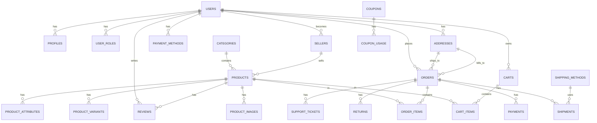

# Base de Datos

ACEROMAX utiliza **Supabase** como Backend-as-a-Service, proporcionando una base de datos PostgreSQL robusta con Row Level Security (RLS) y APIs automáticas.

## 🗄️ Esquema de Base de Datos

### Diagrama de Relaciones



## 📊 Tablas Principales

### 1. Usuarios y Autenticación

#### `auth.users` (Supabase Auth)
```sql
-- Tabla gestionada por Supabase Auth
-- Campos principales:
id: uuid PRIMARY KEY
email: text UNIQUE
encrypted_password: text
email_confirmed_at: timestamptz
created_at: timestamptz
updated_at: timestamptz
```

#### `profiles`
```sql
CREATE TABLE profiles (
  id uuid PRIMARY KEY REFERENCES auth.users(id),
  first_name text,
  last_name text,
  phone text,
  avatar_url text,
  is_seller boolean DEFAULT false,
  is_verified boolean DEFAULT false,
  is_active boolean DEFAULT true,
  last_login_at timestamptz,
  created_at timestamptz DEFAULT now(),
  updated_at timestamptz DEFAULT now()
);
```

#### `user_roles`
```sql
CREATE TABLE user_roles (
  id uuid PRIMARY KEY DEFAULT uuid_generate_v4(),
  user_id uuid REFERENCES auth.users(id) UNIQUE,
  role text CHECK (role IN ('admin', 'manager', 'customer')),
  created_at timestamptz DEFAULT now(),
  updated_at timestamptz DEFAULT now(),
  created_by uuid REFERENCES auth.users(id)
);
```

### 2. Catálogo de Productos

#### `categories`
```sql
CREATE TABLE categories (
  id uuid PRIMARY KEY DEFAULT uuid_generate_v4(),
  name text NOT NULL,
  slug text UNIQUE NOT NULL,
  description text,
  parent_id uuid REFERENCES categories(id),
  image_url text,
  is_active boolean DEFAULT true,
  sort_order integer DEFAULT 0,
  created_at timestamptz DEFAULT now(),
  updated_at timestamptz DEFAULT now()
);
```

#### `sellers`
```sql
CREATE TABLE sellers (
  id uuid PRIMARY KEY DEFAULT uuid_generate_v4(),
  user_id uuid REFERENCES auth.users(id) UNIQUE,
  business_name text NOT NULL,
  business_email text NOT NULL,
  business_phone text NOT NULL,
  description text,
  logo_url text,
  banner_url text,
  tax_id text,
  business_address text NOT NULL,
  is_verified boolean DEFAULT false,
  is_active boolean DEFAULT true,
  rating numeric(3,2) DEFAULT 0.00,
  total_sales numeric(12,2) DEFAULT 0.00,
  commission_rate numeric(5,2) DEFAULT 15.00,
  created_at timestamptz DEFAULT now(),
  updated_at timestamptz DEFAULT now()
);
```

#### `products`
```sql
CREATE TABLE products (
  id uuid PRIMARY KEY DEFAULT uuid_generate_v4(),
  seller_id uuid REFERENCES sellers(id) NOT NULL,
  category_id uuid REFERENCES categories(id),
  name text NOT NULL,
  slug text UNIQUE NOT NULL,
  description text NOT NULL,
  short_description text,
  sku text UNIQUE NOT NULL,
  price numeric(10,2) NOT NULL CHECK (price >= 0),
  compare_at_price numeric(10,2) CHECK (compare_at_price >= 0),
  cost_price numeric(10,2) CHECK (cost_price >= 0),
  quantity integer DEFAULT 0 CHECK (quantity >= 0),
  low_stock_threshold integer DEFAULT 10,
  weight numeric(8,2),
  dimensions jsonb,
  is_active boolean DEFAULT true,
  is_featured boolean DEFAULT false,
  tags text[],
  metadata jsonb,
  created_at timestamptz DEFAULT now(),
  updated_at timestamptz DEFAULT now()
);
```

### 3. Carrito y Órdenes

#### `carts`
```sql
CREATE TABLE carts (
  id uuid PRIMARY KEY DEFAULT uuid_generate_v4(),
  user_id uuid REFERENCES auth.users(id),
  session_id text,
  created_at timestamptz DEFAULT now(),
  updated_at timestamptz DEFAULT now()
);
```

#### `cart_items`
```sql
CREATE TABLE cart_items (
  id uuid PRIMARY KEY DEFAULT uuid_generate_v4(),
  cart_id uuid REFERENCES carts(id) NOT NULL,
  product_id uuid REFERENCES products(id) NOT NULL,
  variant_id uuid REFERENCES product_variants(id),
  quantity integer NOT NULL CHECK (quantity > 0),
  price numeric(10,2) NOT NULL CHECK (price >= 0),
  created_at timestamptz DEFAULT now(),
  updated_at timestamptz DEFAULT now()
);
```

#### `orders`
```sql
CREATE TABLE orders (
  id uuid PRIMARY KEY DEFAULT uuid_generate_v4(),
  order_number text UNIQUE NOT NULL,
  user_id uuid REFERENCES auth.users(id) NOT NULL,
  status text DEFAULT 'pending' CHECK (status IN ('pending', 'processing', 'shipped', 'delivered', 'cancelled', 'refunded')),
  payment_status text DEFAULT 'pending' CHECK (payment_status IN ('pending', 'paid', 'failed', 'refunded')),
  subtotal numeric(12,2) NOT NULL CHECK (subtotal >= 0),
  tax numeric(12,2) DEFAULT 0 CHECK (tax >= 0),
  shipping_cost numeric(12,2) DEFAULT 0 CHECK (shipping_cost >= 0),
  discount_amount numeric(12,2) DEFAULT 0 CHECK (discount_amount >= 0),
  total numeric(12,2) NOT NULL CHECK (total >= 0),
  currency text DEFAULT 'USD',
  shipping_address_id uuid REFERENCES addresses(id) NOT NULL,
  billing_address_id uuid REFERENCES addresses(id) NOT NULL,
  shipping_method text NOT NULL,
  tracking_number text,
  notes text,
  metadata jsonb,
  estimated_delivery_date timestamptz,
  created_at timestamptz DEFAULT now(),
  updated_at timestamptz DEFAULT now(),
  shipped_at timestamptz,
  delivered_at timestamptz,
  cancelled_at timestamptz
);
```

### 4. Direcciones y Pagos

#### `addresses`
```sql
CREATE TABLE addresses (
  id uuid PRIMARY KEY DEFAULT uuid_generate_v4(),
  user_id uuid REFERENCES auth.users(id) NOT NULL,
  type text NOT NULL CHECK (type IN ('shipping', 'billing')),
  is_default boolean DEFAULT false,
  full_name text NOT NULL,
  phone text NOT NULL,
  address_line_1 text NOT NULL,
  address_line_2 text,
  city text NOT NULL,
  state text NOT NULL,
  postal_code text NOT NULL,
  country text NOT NULL,
  created_at timestamptz DEFAULT now(),
  updated_at timestamptz DEFAULT now()
);
```

#### `payment_methods`
```sql
CREATE TABLE payment_methods (
  id uuid PRIMARY KEY DEFAULT uuid_generate_v4(),
  user_id uuid REFERENCES auth.users(id) NOT NULL,
  type text NOT NULL CHECK (type IN ('credit_card', 'debit_card', 'paypal')),
  is_default boolean DEFAULT false,
  card_last_four text,
  card_brand text,
  card_exp_month integer,
  card_exp_year integer,
  provider text NOT NULL,
  provider_payment_method_id text NOT NULL,
  created_at timestamptz DEFAULT now(),
  updated_at timestamptz DEFAULT now()
);
```

## 🔒 Row Level Security (RLS)

### Políticas de Seguridad

#### Perfiles de Usuario
```sql
-- Los usuarios solo pueden ver su propio perfil
CREATE POLICY "Users can view own profile" ON profiles
  FOR SELECT USING (auth.uid() = id);

-- Los usuarios pueden actualizar su propio perfil
CREATE POLICY "Users can update own profile" ON profiles
  FOR UPDATE USING (auth.uid() = id);

-- Los usuarios pueden insertar su propio perfil
CREATE POLICY "Users can insert own profile" ON profiles
  FOR INSERT WITH CHECK (auth.uid() = id);
```

#### Productos
```sql
-- Todos pueden ver productos activos
CREATE POLICY "Products are viewable by everyone" ON products
  FOR SELECT USING (is_active = true);

-- Solo admins y managers pueden insertar productos
CREATE POLICY "Only admins can insert products" ON products
  FOR INSERT WITH CHECK (
    EXISTS (
      SELECT 1 FROM user_roles 
      WHERE user_id = auth.uid() 
      AND role IN ('admin', 'manager')
    )
  );

-- Solo admins y managers pueden actualizar productos
CREATE POLICY "Only admins can update products" ON products
  FOR UPDATE USING (
    EXISTS (
      SELECT 1 FROM user_roles 
      WHERE user_id = auth.uid() 
      AND role IN ('admin', 'manager')
    )
  );
```

#### Carritos
```sql
-- Los usuarios solo pueden ver su propio carrito
CREATE POLICY "Users can view own cart" ON carts
  FOR SELECT USING (auth.uid() = user_id);

-- Los usuarios pueden insertar su propio carrito
CREATE POLICY "Users can insert own cart" ON carts
  FOR INSERT WITH CHECK (auth.uid() = user_id);

-- Los usuarios pueden actualizar su propio carrito
CREATE POLICY "Users can update own cart" ON carts
  FOR UPDATE USING (auth.uid() = user_id);
```

#### Órdenes
```sql
-- Los usuarios solo pueden ver sus propias órdenes
CREATE POLICY "Users can view own orders" ON orders
  FOR SELECT USING (auth.uid() = user_id);

-- Los usuarios pueden insertar sus propias órdenes
CREATE POLICY "Users can insert own orders" ON orders
  FOR INSERT WITH CHECK (auth.uid() = user_id);

-- Solo admins pueden actualizar órdenes
CREATE POLICY "Only admins can update orders" ON orders
  FOR UPDATE USING (
    EXISTS (
      SELECT 1 FROM user_roles 
      WHERE user_id = auth.uid() 
      AND role IN ('admin', 'manager')
    )
  );
```

## 🔧 Funciones y Triggers

### Triggers de Timestamps

```sql
-- Función para manejar created_at
CREATE OR REPLACE FUNCTION public.handle_created_at()
RETURNS TRIGGER AS $$
BEGIN
  NEW.created_at = now();
  RETURN NEW;
END;
$$ LANGUAGE plpgsql;

-- Función para manejar updated_at
CREATE OR REPLACE FUNCTION public.handle_updated_at()
RETURNS TRIGGER AS $$
BEGIN
  NEW.updated_at = now();
  RETURN NEW;
END;
$$ LANGUAGE plpgsql;

-- Aplicar triggers a todas las tablas
CREATE TRIGGER handle_created_at BEFORE INSERT ON profiles
  FOR EACH ROW EXECUTE FUNCTION public.handle_created_at();

CREATE TRIGGER handle_updated_at BEFORE UPDATE ON profiles
  FOR EACH ROW EXECUTE FUNCTION public.handle_updated_at();
```

### Función de Roles

```sql
-- Función para verificar si un usuario es admin
CREATE OR REPLACE FUNCTION is_admin()
RETURNS boolean
LANGUAGE sql
SECURITY DEFINER
AS $$
  SELECT EXISTS (
    SELECT 1 FROM user_roles 
    WHERE user_id = auth.uid() 
    AND role = 'admin'
  );
$$;

-- Función para verificar si un usuario es admin o manager
CREATE OR REPLACE FUNCTION is_admin_or_manager()
RETURNS boolean
LANGUAGE sql
SECURITY DEFINER
AS $$
  SELECT EXISTS (
    SELECT 1 FROM user_roles 
    WHERE user_id = auth.uid() 
    AND role IN ('admin', 'manager')
  );
$$;
```

## 📈 Migraciones

### Lista de Migraciones

| Versión | Nombre | Descripción |
|---------|--------|-------------|
| `20251008070249` | `initial_schema` | Esquema inicial completo |
| `20251008070405` | `rls_policies` | Políticas de seguridad RLS |
| `20251008070811` | `seed_base_data` | Datos base (categorías, productos) |
| `20251008071038` | `fix_security_search_path_v2` | Corrección de seguridad |
| `20251008082245` | `consolidate_duplicate_carts` | Limpieza de carritos duplicados |
| `20251008091720` | `create_admin_roles_system` | Sistema de roles admin |
| `20251008093823` | `fix_user_roles_rls_policies` | Corrección de políticas RLS |
| `20251008095212` | `add_estimated_delivery_to_orders` | Fecha estimada de entrega |

### Aplicar Migraciones

```bash
# En Supabase Dashboard > SQL Editor
-- Ejecutar cada migración en orden:

-- 1. Esquema inicial
\i supabase/migrations/20251008070249_initial_schema.sql

-- 2. Políticas RLS
\i supabase/migrations/20251008070405_rls_policies.sql

-- 3. Datos base
\i supabase/migrations/20251008070811_seed_base_data.sql

-- ... y así sucesivamente
```

## 🔍 Consultas Comunes

### Obtener Productos con Categoría

```sql
SELECT 
  p.id,
  p.name,
  p.price,
  p.image_url,
  c.name as category_name,
  s.business_name as seller_name
FROM products p
JOIN categories c ON p.category_id = c.id
JOIN sellers s ON p.seller_id = s.id
WHERE p.is_active = true
ORDER BY p.created_at DESC;
```

### Obtener Carrito del Usuario

```sql
SELECT 
  ci.id,
  ci.quantity,
  ci.price,
  p.name as product_name,
  p.image_url,
  p.sku
FROM cart_items ci
JOIN products p ON ci.product_id = p.id
JOIN carts c ON ci.cart_id = c.id
WHERE c.user_id = auth.uid()
ORDER BY ci.created_at DESC;
```

### Obtener Órdenes con Detalles

```sql
SELECT 
  o.id,
  o.order_number,
  o.status,
  o.total,
  o.created_at,
  a.full_name,
  a.city,
  a.state,
  COUNT(oi.id) as items_count
FROM orders o
JOIN addresses a ON o.shipping_address_id = a.id
LEFT JOIN order_items oi ON o.id = oi.order_id
WHERE o.user_id = auth.uid()
GROUP BY o.id, a.full_name, a.city, a.state
ORDER BY o.created_at DESC;
```

### Estadísticas de Ventas (Admin)

```sql
SELECT 
  DATE_TRUNC('month', created_at) as month,
  COUNT(*) as orders_count,
  SUM(total) as total_revenue,
  AVG(total) as avg_order_value
FROM orders
WHERE status IN ('delivered', 'shipped')
GROUP BY DATE_TRUNC('month', created_at)
ORDER BY month DESC;
```

## 🛠️ Configuración de Supabase

### Variables de Entorno

```env
# Supabase Configuration
NEXT_PUBLIC_SUPABASE_URL=https://your-project.supabase.co
NEXT_PUBLIC_SUPABASE_ANON_KEY=your-anon-key

# Optional: Service Role Key (solo para operaciones admin)
SUPABASE_SERVICE_ROLE_KEY=your-service-role-key
```

### Configuración de RLS

1. **Habilitar RLS** en todas las tablas:
```sql
ALTER TABLE products ENABLE ROW LEVEL SECURITY;
ALTER TABLE orders ENABLE ROW LEVEL SECURITY;
-- ... para todas las tablas
```

2. **Crear políticas** específicas para cada tabla
3. **Probar políticas** con diferentes usuarios y roles

### Configuración de Autenticación

1. **Habilitar providers** en Authentication > Providers
2. **Configurar email templates** en Authentication > Email Templates
3. **Configurar OAuth** (Google, Facebook, etc.)

## 📊 Monitoreo y Performance

### Dashboard de Supabase

- **Database > Tables**: Ver estructura y datos
- **Database > Logs**: Ver queries ejecutadas
- **Database > Performance**: Métricas de performance
- **Authentication > Users**: Usuarios registrados
- **Authentication > Logs**: Logs de autenticación

### Optimización de Queries

```sql
-- Índices para mejorar performance
CREATE INDEX idx_products_category_id ON products(category_id);
CREATE INDEX idx_products_seller_id ON products(seller_id);
CREATE INDEX idx_products_is_active ON products(is_active);
CREATE INDEX idx_orders_user_id ON orders(user_id);
CREATE INDEX idx_orders_status ON orders(status);
CREATE INDEX idx_cart_items_cart_id ON cart_items(cart_id);
```

### Backup y Restore

```bash
# Backup completo
pg_dump "postgresql://postgres:[password]@[host]:5432/postgres" > backup.sql

# Restore
psql "postgresql://postgres:[password]@[host]:5432/postgres" < backup.sql
```

## 🧪 Testing de Base de Datos

### Datos de Prueba

```sql
-- Insertar categorías de prueba
INSERT INTO categories (name, slug, description) VALUES
('Acero Inoxidable', 'acero-inoxidable', 'Productos de acero inoxidable'),
('Acero Estructural', 'acero-estructural', 'Vigas y perfiles estructurales'),
('Herramientas', 'herramientas', 'Herramientas para construcción');

-- Insertar productos de prueba
INSERT INTO products (seller_id, category_id, name, slug, description, sku, price, quantity) VALUES
(
  (SELECT id FROM sellers LIMIT 1),
  (SELECT id FROM categories WHERE slug = 'acero-inoxidable'),
  'Acero Inoxidable 304',
  'acero-inoxidable-304',
  'Acero inoxidable de alta calidad para uso industrial',
  'AI304-001',
  150.00,
  100
);
```

### Pruebas de RLS

```sql
-- Test como usuario normal
SET ROLE authenticated;
SELECT * FROM products; -- Solo productos activos

-- Test como admin
SET ROLE authenticated;
-- Simular usuario admin
SELECT * FROM products; -- Todos los productos
```

## 🔮 Futuras Mejoras

### Funcionalidades Adicionales

- [ ] **Full-text search** con PostgreSQL
- [ ] **Geolocalización** para direcciones
- [ ] **Audit logs** para cambios críticos
- [ ] **Soft deletes** para datos importantes
- [ ] **Data archiving** para órdenes antiguas

### Performance

- [ ] **Read replicas** para consultas pesadas
- [ ] **Connection pooling** optimizado
- [ ] **Query optimization** con EXPLAIN ANALYZE
- [ ] **Caching** con Redis (futuro)

### Seguridad

- [ ] **Encryption at rest** para datos sensibles
- [ ] **Data masking** para desarrollo
- [ ] **Backup encryption**
- [ ] **Audit trail** completo

